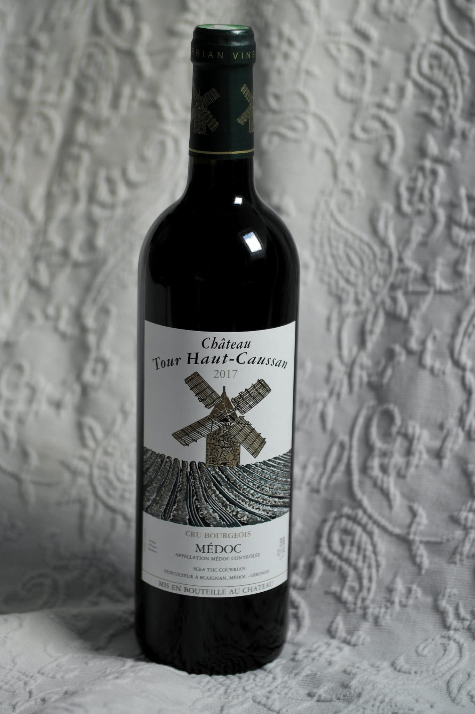

# Chateau Tour Haut-Caussan (Medoc)

## 🍷 Wine Profile

### 🌍 Origin

| Country       | Region        | Appellation   |
|---------------|---------------|---------------|
| `France`      | `Bordeaux`    | `Medoc`       |

### 🍇 Wine Details

| Type          | Grapes                          | Alcohol (ABV)  |
|---------------|---------------------------------|----------------|
| `Red`         | `Cabernet Sauvignon` `Merlot`| `13%`          |

### 🎨 Appearance

| Intensity             | Colour                    |
|-----------------------|---------------------------|
| `Pale`🔹🔹💠🔸`Deep`  | `Ruby`                    |

### 👃 Nose

| Intensity                     |
|-------------------------------|
| `Light`🔹🔹💠🔸`Pronounced`  |

| Aromas                    |
|---------------------------|
| 🍇 `Blackcurrant`         |
| 🔵 `Blackberry`           |

### 👅 Palate

| Acidity               | Tannin              | Body                |
|-----------------------|---------------------|---------------------|
| `Low`🔹🔹🔹💠`High`   | `Low`🔹🔹💠🔸`High`|`Light`🔹🔹🔹💠`Full`|

| Sweetness                 |
|---------------------------|
| `Dry`💠🔸🔸🔸 `Sweet`|

| Aromas                    |
|---------------------------|
| 🍇 `Blackcurrant`         |
| 🔵 `Blackberry`           |
| 🐂 `Leather`              |
| 🍂 `Earthy`               |
| ✏️ `Graphite`             |
| 🍛 `Spice(pepper,vanilla` |

### 🏆 Conclusions

**Quality Level:** `Good`
