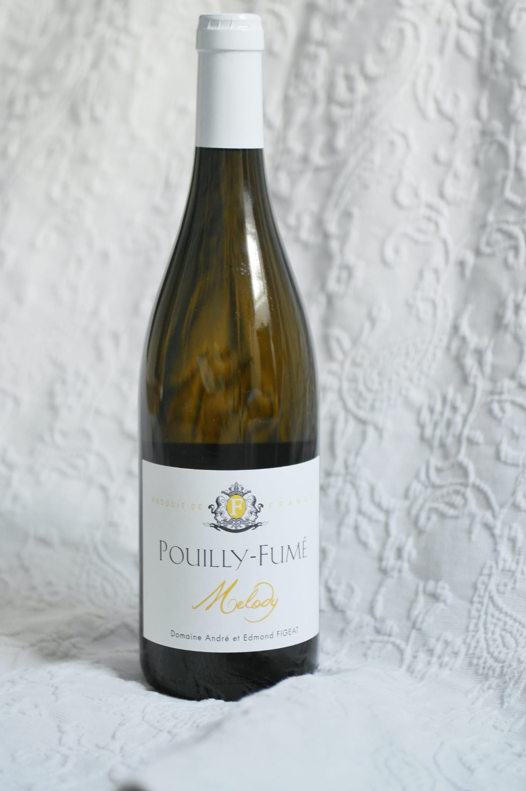

# Melody Pouilly-Fume

## 🍷 Wine Profile

### 🌍 Origin

| Country       | Region        | Appellation   |
|---------------|---------------|---------------|
| `France`      | `Loire Valley`| `Pouilly-Fume`|

### 🍇 Wine Details

| Type          | Grapes                    | Alcohol (ABV)  |
|---------------|---------------------------|----------------|
| `White`       | `Sauvignon Blanc`         | `ABV %`        |

### 🎨 Appearance

| Intensity     | Colour                    |
|---------------|---------------------------|
| `Pale`🔹💠🔸🔸🔸`Deep`   | `Colour`       |

### 👃 Nose

| Intensity                     | Aromas                    |
|-------------------------------|---------------------------|
| `Light`🔹💠🔸🔸🔸`Pronounced` | 🍐🍏                     |

### 👅 Palate

| Acidity               | Body          | Sweetness                 | Tannin        | Aromas                    |
|-----------------------|---------------|---------------------------|---------------|---------------------------|
| `Low`🔹🔹🔹💠🔸`High` | `Body`        | `Dry`🔹💠🔸🔸🔸 `Sweet`  | ❌            | 🍐🍏🍍 🎇              |

### 🏆 Conclusions

**Quality Level:** `Good`
