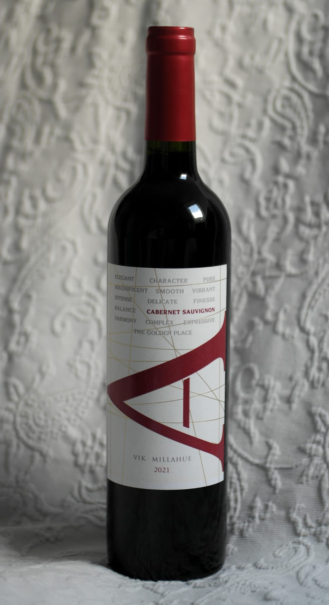

# Vik A (Cachapoal)

## 🍷 Wine Profile

### 🌍 Origin

| Country       | Region          | Appellation          |
|---------------|-----------------|----------------------|
| `Chile`       | `Central Valley`| `Cachapoal Valley`   |

### 🍇 Wine Details

| Type          | Grapes                    | Alcohol (ABV)  |
|---------------|---------------------------|----------------|
| `Red`         | `Cabernet Sauvignon`      | `ABV 14%`        |

### 🎨 Appearance

| Intensity            | Colour                    |
|----------------------|---------------------------|
| `Pale`🔹🔹🔹💠`Deep` | `Ruby`                    |

### 👃 Nose

| Intensity                     |
|-------------------------------|
| `Light`🔹🔹💠🔸`Pronounced`  |

| Aromas                    |
|---------------------------|
| 🍇 `Blackcurrant`         |
| 🔵 `Blackberry`           |
| 🌿 `Mint`                 |

### 👅 Palate

| Acidity               | Tannin              | Body                |
|-----------------------|---------------------|---------------------|
| `Low`🔹🔹🔹💠`High`   | `Low`🔹🔹🔹💠`High`|`Light`🔹🔹🔹💠`Full`|

| Sweetness                 |
|---------------------------|
| `Dry`💠🔸🔸🔸 `Sweet`     |

| Aromas                    |
|---------------------------|
| 🍇 `Blackcurrant`         |
| 🔵 `Blackberry`           |
| 🔴 `Plum`                 | 
| 🌿 `Mint`                 |
| ⚫ `Black pepper`         |
| 🚬 `Tobacco`              |
| 🍂 `Cinnamon`             |
| 🐐 `Leather`              |
| 🍄 `Earthy`               |
| 🔥 `Smoke`                |

### 🏆 Conclusions

**Quality Level:** `Very Good`
