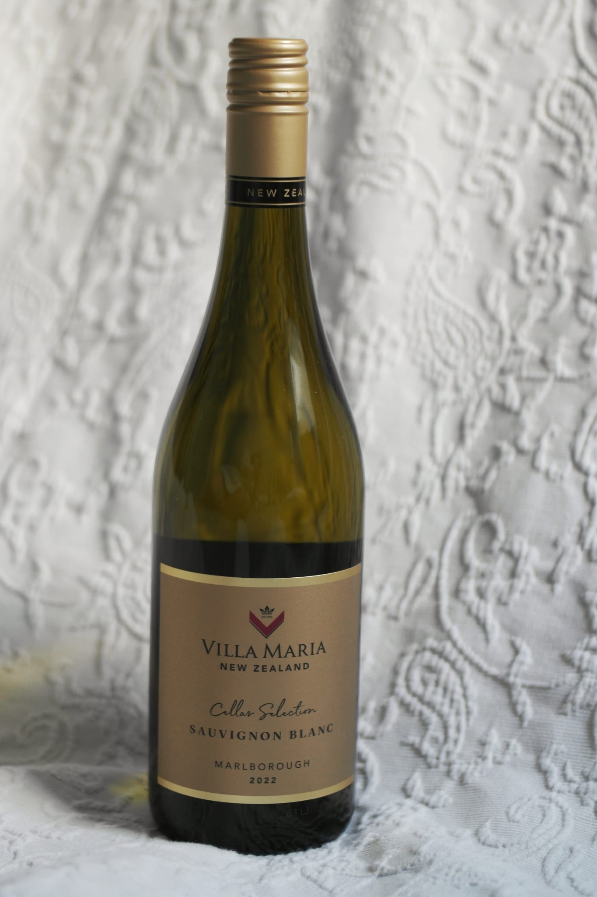

# Villa Maria Marlborough

## 🍷 Wine Profile

### 🌍 Origin

| Country       | Region        | Appellation   |
|---------------|---------------|---------------|
| `New Zealand` | `Marlborough` | `Marlborough` |

### 🍇 Wine Details

| Type          | Grapes                    | Alcohol (ABV)  |
|---------------|---------------------------|----------------|
| `White`       | `Sauvignon Blanc`         | `ABV %`        |

### 🎨 Appearance

| Intensity     | Colour                    |
|---------------|---------------------------|
| `Pale`🔹💠🔸🔸`Deep`   | `Lemon`        |

### 👃 Nose

| Intensity                     |
|-------------------------------|
| `Light`🔹💠🔸🔸`Pronounced`  |

| Aromas                    |
|---------------------------|
| 🍏 `Green apple`          |
| 🍐 `Pear`                 |

### 👅 Palate

| Acidity               | Tannin      | Body                |
|-----------------------|-------------|---------------------|
| `Low`🔹🔹💠🔸`High`   | ❌         |`Light`💠🔹🔹🔹`Full`|

| Sweetness                 |
|---------------------------|
| `Dry`🔹💠🔸🔸 `Sweet`|

| Aromas                    |
|---------------------------|
| 🍏 `Green apple`          |
| 🍐 `Pear`                 |
| 🍋 `Lemon`                |
| 🍍 `Pineapple`            |
| 🍠 `Lychee`               |
| 🌱 `Grass`                |

### 🏆 Conclusions

**Quality Level:** `Very Good`
